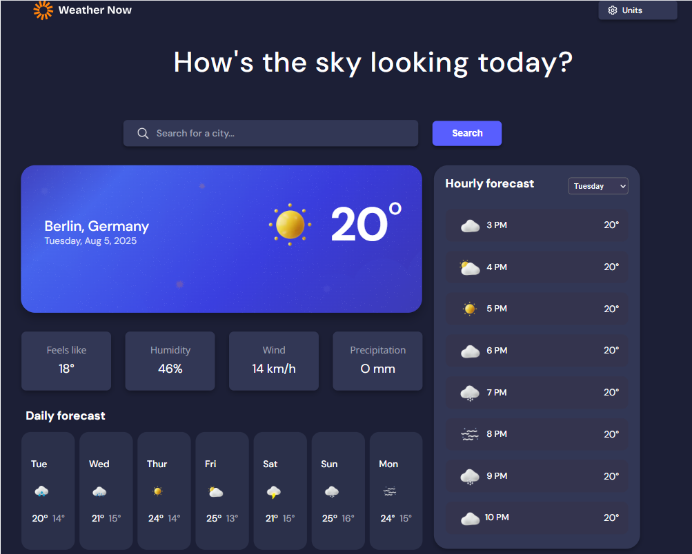

# 🌦️ Frontend Mentor - Weather App Solution

This is a solution to the [Weather app challenge on Frontend Mentor](https://www.frontendmentor.io/challenges/weather-app-K1FhddVm49). Frontend Mentor challenges help you improve your coding skills by building realistic projects.

---

## Table of contents

* [Overview](#overview)
    * [The Challenge](#the-challenge)
    * [Screenshot](#screenshot)
    * [Links](#links)
* [My Process](#my-process)
    * [Built with](#built-with)
    * [What I Learned](#what-i-learned)
    * [Continued Development](#continued-development)
* [Author](#author)

---

## Overview

### The Challenge

The primary goal of this solution was to build the complete, pixel-perfect, and fully **responsive visual interface** for the weather application, allowing for future integration with a live data source.

The interface was designed to support the following features:

* **Location Search Bar** and **Unit Toggle** elements.
* Display of **current weather conditions** and **additional metrics**.
* **7-day forecast** and **hourly forecast** structure.
* **Optimal responsive layout** across all device sizes.
* Correct **hover and focus states** for all interactive elements.

### Screenshot

### Links

* **Solution URL:** [Add your solution URL here]
* **Live Site URL:** [Add your live site URL here]

---

## 🛠️ My Process

### Built with

This entire front-end layout and design were achieved using only HTML and CSS, demonstrating foundational web development mastery.

* **Semantic HTML5** markup
* **CSS Custom Properties** (Variables)
* **Flexbox** and **CSS Grid** for complex layout management
* **Mobile-first workflow**, ensuring optimal display from the smallest screens (320px) up to **desktop layouts (1440px)**, as per the style guide.
* **Media Queries**

### What I Learned

Focusing solely on HTML and CSS for this intricate layout provided excellent learning opportunities:

* **Advanced Layout with CSS Grid:** Successfully structuring the dense data panels (like the additional metrics and hourly forecast) using **CSS Grid** to ensure data alignment and smooth flow on different breakpoints.
* **Pure CSS Interactivity:** Implementing the visual toggle for Metric/Imperial units and simulating the day selector using **CSS pseudo-classes (`:checked`)** to maintain the look and feel of a functional app element.
* **Designing for Data Density and Responsiveness:** Mastering the responsive design to ensure that tables and lists, which hold a large amount of forecast data, remain **readable and well-spaced** on the smallest mobile screens. This included careful use of media queries to adapt the layout between **mobile (375px)** and **desktop (1440px)** views.

### Continued Development

The next steps for this project are to integrate a data source:

* **JavaScript Integration:** Adding JavaScript to handle the search functionality, fetch live weather data from an API, and dynamically update the content and unit conversions.
* **Accessibility (A11y):** Further enhancing keyboard navigation and ARIA attributes for the various forecast elements and toggles.

---

## Author

* **Frontend Mentor:** [@SarahNdom](https://www.frontendmentor.io/profile/Sarahndom)
* **GitHub:** [https://github.com/sarahndom](https://github.com/sarahndom)